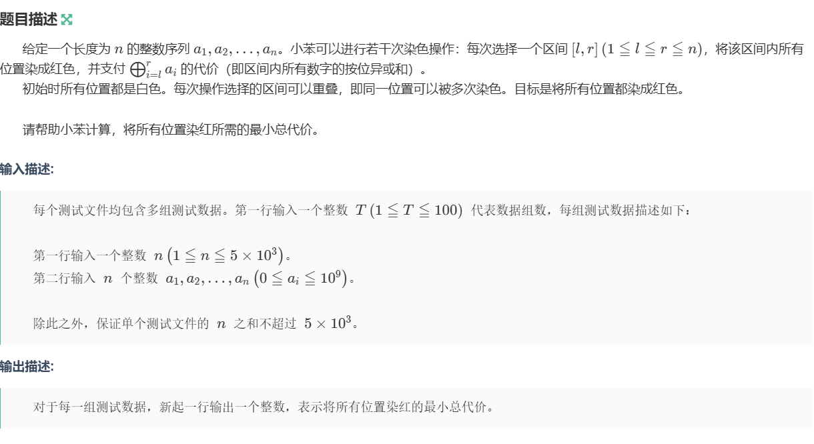

本质是：
1.明确我要找到的目标：(比方说是在第n个状态时需要计算max,min);
2.思考：
（从递推的角度出发：直接算第n个状态时不太可能，因为这一个状态时从之前的所有的合法状态转移取max或min而来，有点像是数学中数列多线路的递推公式），想清这个状态是如何由之前的状态转移得到

3.想请便可以以递推的想法由下到上的解决；
4.初始底层状态
5.思考在高层状态是怎么由底层状态转移而来，从而找到并枚举之前所有合法的状态；
6.到达题目的top状态，根据题目意思得出答案

## 例题1

[D-小苯的序列涂色_牛客周赛 Round 137](https://ac.nowcoder.com/acm/contest/130843/D

```c++
#include <bits/stdc++.h>
using namespace std;
#define int long long
const int mod = 1e9 + 7;
const int N = 3e5 + 7;

void solve() { 
    int n;
    cin >> n;
    vector<int> a(n + 1),acc(n + 1);
    //对于要求连续区间的异或值，需要建立一个异或前缀和
    for(int i = 1;i <= n;i++) {
        cin >> a[i];
        acc[i] = acc[i - 1] ^ a[i];
    }
    //
    vector<int> dp(n + 1,1e18);
    dp[0] = 0;
    for(int i = 1;i <= n;i++) {
        int mn = 1e18;
        for(int j = i;j >= 1;j--) {
            mn = min(mn,dp[j - 1]);
            dp[i] = min(dp[i],(acc[i] ^ acc[j - 1]) + mn);
        }
    }
    cout << dp[n] << endl;
    return;
} 
```

**这题可以用上时间o(n * n); (通常是dp写法)

**问题是：到第n个位置时的最小总代价；
我们可以先解决的在前i个位置时的最小的总代价：
`dp[i]` 时表示前i个位置时的最小的总代价；
转移方程 :` dp[i] = acc[i] ^ acc[j - 1] + mn`; j为左端点
`acc[i] ^ acc[j - 1]`表示的是从j到i的异或和；
mn这是将左端点向左枚举，同时维护dp(min)值，因为每一个块可以重复染色；
将左区间枚举完成，维护min情况，递推到第n层即可；

