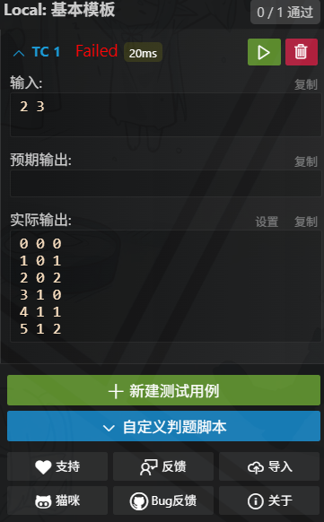

#### 这里就是将一个在二维上的坐标 i , j 压缩到一个一维下标x上，在一些题目中可以简化写法带来方便
```c++
#include <bits/stdc++.h>
using namespace std;
#define int long long
const int mod = 1e9 + 7;
const int N = 3e5 + 7;
int f(int i,int j,int m) {
    return i * m + j;
}
void solve() {
    int n,m;
    cin >> n >> m;
    for(int i = 0;i < n;i++) {
        for(int j = 0;j < m;j++) {
            int cur = f(i,j,m);
            cout << cur << " ";
            cout << cur / m << " " << cur % m << endl;
        }
    }
    return;
}

signed main() {
    ios::sync_with_stdio(false);
    cin.tie(nullptr);
    cout.tie(0);
    int T = 1;
    //cin >> T;
    while (T--) {
        solve();
    }
    return 0;
}
```

### 结果表示：
**第1个表示的是压缩成1维后的坐标
第2，3个表示的是这个压缩所得到的一维坐标对应的二维i，j下标



