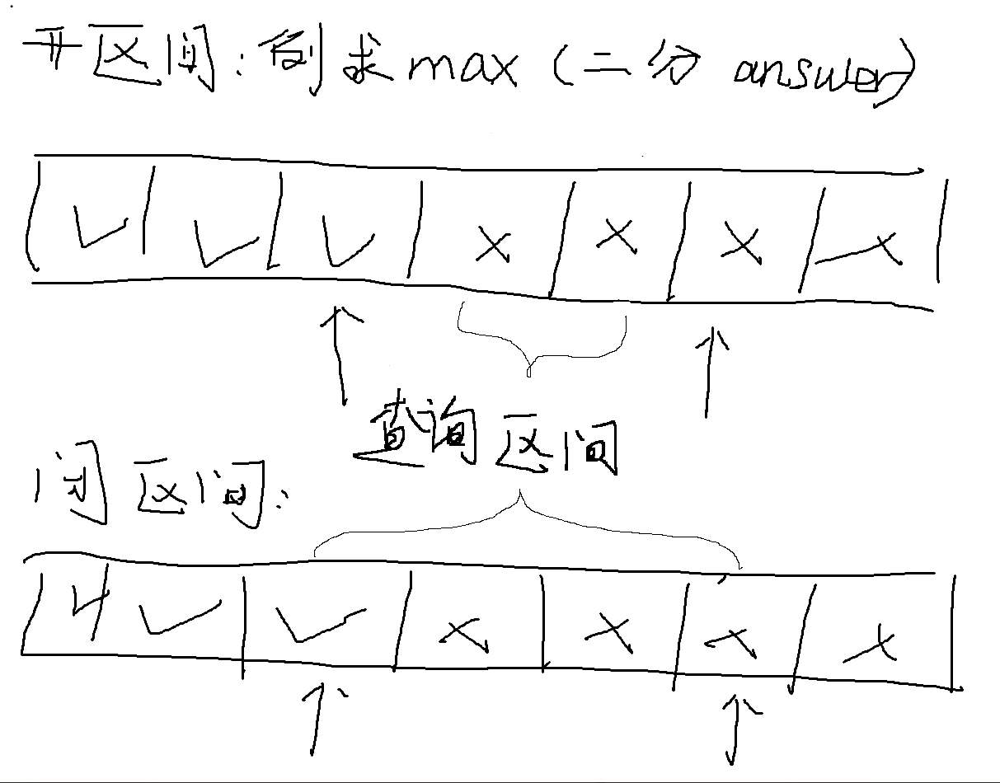
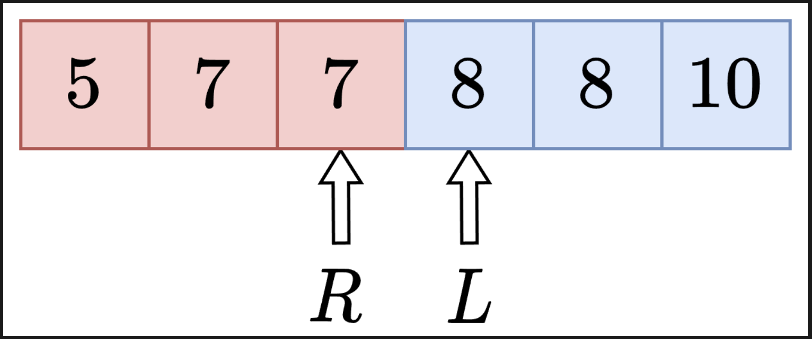

# 二分答案

一些常见的问题：
1.什么是循环不变量？
答：想一想，对于求最小的题目，开区间二分的写法，为什么最终返回的是 right，而不是别的数？在初始化（循环之前）、循环中、循环结束后，都时时刻刻保证 check(right) == true 和 check(left) == false，这就叫循环不变量。根据循环不变量，循环结束时 left+1=right，那么 right 就是最小的满足要求的数（因为再 −1 就不满足要求了），所以答案是 right。

2.**问**：有些题目，明明 m 可以是答案，但却不在初始二分区间中。比如闭区间二分初始化 right=m−1或者开区间 right= m，这不会算错吗？
答：不会算错。注意「答案所在区间」和「二分区间」是两个概念。想一想，如果二分的 while 循环每次更新的都是 left，那么最终答案是什么？正好就是 m。一般地，如果一开始就能确定 m 一定可以满足题目要求，那么 m 是不需要在二分区间中的。换句话说，二分区间是「尚未确定是否满足题目要求」的数的范围。那些在区间外面的数，都是已确定的满足（不满足）题目要求的数。

3.推荐用开区间：

**好处：
对于开区间，端点处和两端点之外已经完成判断，查询区间为这两个端点之间（但不含两个端点）；
对于闭区间，端点出是一个还没完成判断但两端点之外已经完成判断，查询区间为这两个端点之间（但包含两个端点）；
这就导致再这while循环的终止条件：
开区间 ： l + 1 < r;
闭区间 ： l < r;（
这里就是常常再写闭区间中，容易发生的错误，再闭区间中的端点的边界位置处理时，没有正确的加1减1，或者忘记加1减1，导致再 l + 1 == r的状态时，发生死循环情况；
但是再闭区间没有可以很好规避这种问题，再 l + 1 == r 处时，因为这已经跳出循环了，也就规避了发生死循环情况；

## 开区间写法：（推荐）

```c++
class Solution {
public:
    // 计算满足 check(x) == true 的最小整数 x
    int binarySearchMin(vector<int>& nums) {
        // 二分猜答案：判断 mid 是否满足题目要求
        auto check = [&](int mid) -> bool {
            
        };

        int left = ; // 循环不变量：check(left) 恒为 false
        int right = ; // 循环不变量：check(right) 恒为 true
        while (left + 1 < right) { // 开区间不为空
            int mid = left + (right - left) / 2;
            if (check(mid)) { // 说明 check(>= mid 的数) 均为 true
                right = mid; // 接下来在 (left, mid) 中二分答案
            } else { // 说明 check(<= mid 的数) 均为 false
                left = mid; // 接下来在 (mid, right) 中二分答案
            }
        }
        // 循环结束后 left+1 = right
        // 此时 check(left) == false 而 check(left+1) == check(right) == true
        // 所以 right 就是最小的满足 check 的值
        return right;
    }
};
```
请注意「求最小」和「求最大」在二分写法上的区别。

「求最小」和二分查找求「排序数组中某元素的第一个位置」是类似的，按照红蓝染色法，左边是不满足要求的（红色），右边则是满足要求的（蓝色）。

「求最大」的题目则相反，左边是满足要求的（蓝色），右边是不满足要求的（红色）。这会导致二分写法和上面的「求最小」有一些区别。

以开区间二分为例：

求最小：check(mid) == true 时更新 right = mid，反之更新 left = mid，最后返回 right.
求最大：check(mid) == true 时更新 left = mid，反之更新 right = mid，最后返回 left.
对于开区间写法，简单来说 check(mid) == true 时更新的是谁，最后就返回谁。
相比其他二分写法，开区间写法不需要思考加一减一等细节，推荐使用开区间写二分。


## 闭区间写法：
**求min
```c++
int find_min(int l, int r) {
    while (l < r) {
        int mid = l + (r - l) / 2;
        if (check(mid)) {
            r = mid;      // 满足，尝试更小
        } else {
            l = mid + 1;  // 不满足，必须变大
        }
    }
    return l;
    //return r;
}
```
求max
```c++
int find_min(int l, int r) {
    while (l < r) {
        int mid = l + (r - l) / 2;
        if (check(mid)) {
            l = mid;      // 满足，尝试更大
        } else {
            r = mid - 1;  // 不满足，必须变小
        }
    }
    return l;
    //return r;
}
```
