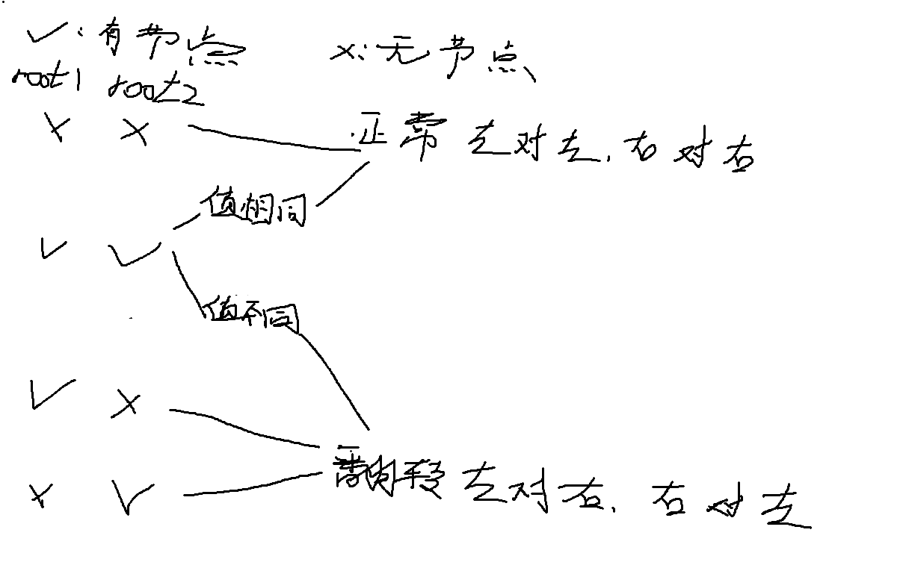

**在写二叉树的dfs遍历我觉得这种题目可以值得记录一下，有关题型如下：
[971. 翻转二叉树以匹配先序遍历](https://leetcode.cn/problems/flip-binary-tree-to-match-preorder-traversal/)
[951. 翻转等价二叉树](https://leetcode.cn/problems/flip-equivalent-binary-trees/)

**这里我就以951题哦作为讲解：
## 951. 翻转等价二叉树

### 题目大况：

**给定两个二叉树，选择任意节点，然后交换它的左子树和右子树，如果可以通过一定的反转次数是的root1 == root2(两颗二叉树相同)，return true,否则 return false;

### 思路： 

**1.其实思路很容易思考，不管root1 和 root2 之间差了多少次反转，只要root1是可以通过一定的反转次数得到root2就一定把对应的节点一一对应遍历完，否则无法遍历完全；

**2.想到这里就基本上完成了，现在就是要思考我怎么样dfs遍历使得在两个相差一定翻转次数的两颗二叉树中去把节点一一对应

**3.步骤：（这里我把root1作为目标去向root2对齐）
 - 在root1的节点数量 == root2的节点数量作为前提；
 - 终止条件：同样当root1节点为空时，return；还有当root1节点不为空时，root2节点为空 或者 两者都不为空且值不同时return  -> 表示无法继续遍历下去；
 - 递归条件：这里我们就要思考节点的状态了，如图：
	
- 最后return (cnt == n && n == n1) ? true : false即可；
### 代码如下：
```c++
/**
 * Definition for a binary tree node.
 * struct TreeNode {
 *     int val;
 *     TreeNode *left;
 *     TreeNode *right;
 *     TreeNode() : val(0), left(nullptr), right(nullptr) {}
 *     TreeNode(int x) : val(x), left(nullptr), right(nullptr) {}
 *     TreeNode(int x, TreeNode *left, TreeNode *right) : val(x), left(left), right(right) {}
 * };
 */

class Solution {
public:
    int cnt = 0;
    void dfs(TreeNode* root1,TreeNode* root2) {
        if(!root1) return;
        if(!root2 || root1->val != root2->val) return;
        cnt++;
        //需要走反转路径
        if(root1->left && root2->left && root1->left->val != root2->left->val || (!root1->left || !root2->left) && (root1->left || root2->left)) {
            dfs(root1->left,root2->right);
            dfs(root1->right,root2->left);
        }
        //不需要
        else {
            dfs(root1->left,root2->left);
            dfs(root1->right,root2->right);
        }
    }
    
    int dfs1(TreeNode* root) {
        if(!root) return 0;
        int n = 1;
        n += dfs1(root->left);
        n += dfs1(root->right);
        return n;
    }
    
    bool flipEquiv(TreeNode* root1, TreeNode* root2) {
        int n = dfs1(root1);
        int n1 = dfs1(root2);  
        dfs(root1,root2);
        return (cnt == n && n == n1) ? true : false;
    }
};
```