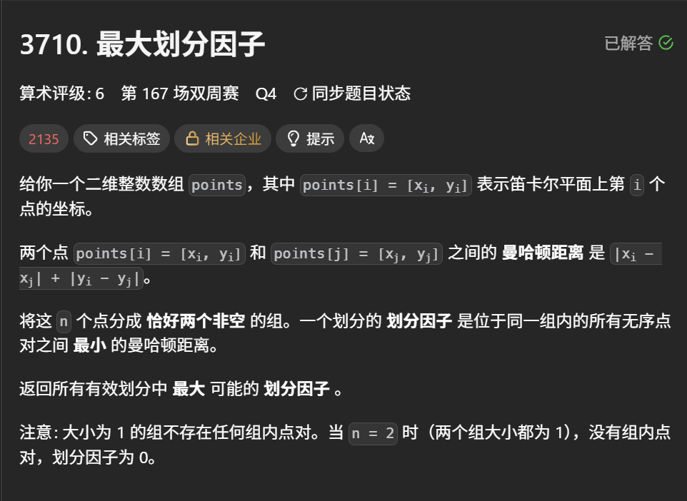

### 思路：
### 思路1.这里我们可以发现了标志性的"最小最大"问题，通常这里存在明显的单调性

- 当我们索取的划分因子越大，对于每一个组的最小划分因子就越来越苛刻，则会越来越达不到我索取的划分因子
- 当我们索取的划分因子越小，对于每一个组的最小划分因子就越来越轻松，则会更加容易达到我索取的划分因子

通常这种单调性问题，我们可以采用 “二分答案” + ”二分图判断“（时间复杂度 ：nlogn）来完成；


### 思路2.这里我们可以才用（kruskal）排序 + (带权)并查集的思路来完成

我们可以把所有的边都表示出来，在按照边的**曼哈顿距离**大小从小到大排序，在依次从小到大遍历去把边对应的两个节点作分离操作（等价于我作删除边操作） --> 这里可以用 0 / 1 异或来表示

这里再对边对应的两个节点作分离操作时会有3中情况，
- 两节点存在未处理点，这里直接进行分离操作；
- 否则，当这里的两个节点都进行了处理，再看他们是否时分离的；
	
	--> 这里和并查集的merge的操作在逻辑上有点反着来，但是代码结构是一样的
	- 当这两个已经是分离的了，则不再进行分离操作 
	- 当这两个是同一组的（一共就两组），这里就出现矛盾，说明当前我的边权就是最大的划分因子


```c++
class Solution {
public:
    vector<int> fa,dis; 
    int find(int x) {
        if(fa[x] == x) return x;
        int t = find(fa[x]);
        dis[x] ^= dis[fa[x]];
        fa[x] = t;
        return t;
    }
    bool merge(int x,int y) {
        int rx = find(x);
        int ry = find(y);
        if(rx == ry) {
            return dis[x] != dis[y];
        }
        fa[ry] = rx;
        dis[ry] = 1 ^ dis[y] ^ dis[x];
        return true;
    }
    int maxPartitionFactor(vector<vector<int>>& points) {
        int n = points.size();
        fa.resize(n);
        ranges::iota(fa,0);
        dis.resize(n);
        vector<tuple<int,int,int>> edges;
        edges.reserve(n * (n - 1) / 2);
        for(int i = 0;i < n;i++) {
            for(int j = i + 1;j < n;j++) {
                int dis = abs(points[i][0] - points[j][0]) + abs(points[i][1] - points[j][1]);
                edges.emplace_back(dis,i,j);
            }
        }
        sort(edges.begin(),edges.end());
        for(auto& [dis,i,j] : edges) {
            if(!merge(i,j)) {
                return dis;
            }
        }
        return 0;
    }
};
```
